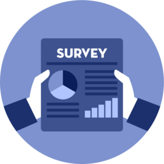

### Contact Me
+1 226-975-6257 | smit98rana@gmail.com

   

## Technical Skills
- **Programming Languages** : Python • R • SQL 
- **Data Analysis** : Pandas • Numpy • Keras • SciKit-Learn • Tensorflow • dplyr • tidyr • tidyverse • tibble
- **Data Visualization** : Tableau • PowerBI (DAX) • Matplotlib • Ploty • Seaborn • ggplot2 • gganimate • gifski
- **Data Processing** : Excel (VLOOKUP • HLOOKUP • VBA • Pivot Tables and Charts • Conditional Formatting • Data Analysis • Solver • Goal Seek • Scenario Manager • Data Tables)
- **Statistical Analysis** : Hypothesis • Regression Analysis • Descriptive and inferential statistics • Exploratory data analysis
- **Machine Learning frameworks** : Models (Linear Regression • Decision tree • Random Forest) • improving the performance (feature selection and engineering • scaling • cross-validation • and parameter tuning) • Deep Learning • Neural Networks
- **Miscellaneous** : Data Science Pipeline (Cleaning • Wrangling • Modeling • Interpretation) • Model Deployment and Integration (Flask • Streamlit) • Data Transformation • Manipulation • MS Visio • Google Dialogflow 

## Education

- **PGC, Data Analytics** : St. Clair College at Windsor, ON (_Sept 2021 - April 2023_), _Cumulative GPA: 3.58 / 4.0 (Academic Honors)_
- **BEng, Computer Engineering** : Gujarat Technological University (_July 2016 - Aug 2020_), _Cumulative CGPA: 8.63 / 10.0 (First Class with Distinction)_

## Work Experience

**Data Coordinator @ Gujarat Narmada Valley Fertilizers & Chemicals (_Jan - Aug 2021_)**
- Diligently collected, stored, and safeguarded trainee data across the company, ensuring strict confidentiality
- Built thorough quarterly and weekly reports on training expenses and activities, allowing for more informed decision making and greater responsibility, and ultimately leading to a surprising 20% boost in organizational performance.
- Offered expert troubleshooting and exceptional customer service support to 60% of non-technical employees within the training department, resolving hardware issues across a range of devices. As a result of taking a preventative stance, the regular participation of top technical professionals was cut by 40%.
- Enthusiastically participated in ongoing training and professional development, staying updated on new technologies and critical business systems. 
- Responsibly executed additional duties as requested by management, fostering team efficiency.

**Software Engineer (Intern)  @ Concept Code Pvt Ltd (_Apr - Jul 2019_)**
- Proven skill in all phases of the Software Development Life Cycle (analysis, design, development, testing, deployment), with a focus on learning C# and the MVC framework.
- Saved the team's time spent on error tickets by an impressive 20% after implementing efficient procedures for monitoring performance, load balancing, and traffic analysis on the company's Live Server.

**Survey Data Analyst @ Phoenix Exim (_Mar 2018 - Dec 2019_)**
- Volunteered with a company that sells office furnishings to compile survey data and learn about their clients' likes and dislikes and overall happiness. Crafted a survey utilizing the Microsoft platform to gather data, followed by careful processing to ensure the highest level of data quality. This comprehensive approach not only facilitated precise analysis but also culminated in the generation of dependable insights.
- Leveraged SQL and Python for data wrangling, manipulation and cleaning tasks, contributing to the development and implementation of technical content for companies’ websites, resulting in a substantial 45% increase in data entry accuracy.
- Develop dynamic Tableau dashboards to visualize sales trends and customer behaviors, aiming to replicate the success achieved previously: a 15% boost in sales revenue and a 10% decrease in customer churn.
- Deliver routine reports to management, highlighting essential performance indicators pertinent to production and customer behaviors.
- Outlined the store's management with detailed survey analysis findings and well-considered recommendations, providing them with a convincing road map for implementable improvements and a surprising 24% uptick in customer satisfaction.

## Projects

### LEGO [View🔗](https://public.tableau.com/app/profile/smit.rana6369/viz/LEGO_16900338877770/Dashboard1)
#### (Tableau)

- Toy building bricks from the LEGO brand are extremely popular. They are typically packaged in sets that can be used to construct a single item. There are several pieces in each set, and they range in size, style, and color.
- Fairly extensive dataset with numerous possibilities for investigation provided by the "sets" file's inclusion of the release year for each set. Dashboard shows following :
  - In what ways have set sizes evolved over time?
  - What hues best represent witchcraft? Using only the bricks, can you determine the set's theme?
  - hich setups do you find yourself using the most often? Which collections contain the rarest pieces?
  - Have there been shifts in the primary colors of LEGOs sold in sets?

### Credit Score Classification (Capstone) [View🔗](https://github.com/gentallman/Capstone)
#### (Python, Tableau, Excel, Machine Learning Frameworks, Streamlit)

- To automate portfolio inspections and credit report generation, we created a credit score classification system. The data was properly cleansed using Python. Consumer credit history is used by machine learning algorithms to classify and forecast credit score categories (good, standard, and poor).
- Through feature selection and engineering, scaling, and parameter optimization, improved model performance was achieved with 80% accuracy. Model and System deployed through the Streamlit app. 
- As a result, financial organizations can generate substantial profits by providing loans to consumers with excellent credit, resulting in a quick and lucrative return on investment.  

### Twitter Sentiment Analysis [View🔗](https://github.com/gentallman/dab303)
#### (Python, Machine Learning Frameworks, Natural Language Toolkit)

- A TensorFlow-based emotional analyzer was built to determine the feelings shared on Twitter (whether good or negative).
- For the text on Twitter, tokenization and the erasure of individual words were utilized. Following the completion of the model training, I used assessment metrics to evaluate the performance of the model with 70% prediction accuracy.
- Businesses can learn how people feel about a subject, which will assist them in making decisions.

### Heart Failure Prediction [View🔗](https://github.com/gentallman/dab304)
#### (Python, Machine Learning Frameworks, Excel, Flask, Power BI)

- Developed a predictive tool to assist healthcare providers in identifying individuals at high risk for heart failure and initiating preventative measures to steer clear of negative results.
- It was determined using EDA, Data Visualization, and ML which factors contribute to cardiac failure. deployed the model with 81% accuracy and integrated it with Flask to create a web application.

### NYC Motor Vehicle Collisions (Storytelling) [View🔗](https://github.com/gentallman/dab201)
#### (Tableau, PowerPoint)

- After conducting a visual study of the incident, we moved on to identifying the underlying reason or causes of the event.
- Tableau was used to create data visualizations that are both visually appealing and easily accessible, and they were applied to the dataset that was provided.
- To prevent future mishaps, it is important to identify injury patterns, different types of ejections, contributing factors, whether the victim is still alive, and any other pertinent information. 

### Study of Ethics for Data Product (Survey Analysis) 
#### (Microsoft Forms, SQL, Excel, Tableau)

- As part of my study of the ethics used in data product development, I developed a (mock) game questionnaire survey to collect data from users while maintaining the 5Cs (consent, clarity, consistency, control, and consequences).
- This survey includes 15 different questions (text, single and multiple choice, rating). A few survey questions are optional, while the remaining questions are required. Following the collection of these data, they were cleansed, transformed in Excel, and then analyzed and visualized using SQL and tableau respectively. This project was created to demonstrate how to implement the 5Cs and ethics when developing a data product.

### Normalized Loss Analysis of Automobiles [View🔗](https://github.com/gentallman/dab501)
#### (R, Regression Model Analysis)

- Project focuses on studying the expenses of luxury automobiles. The dataset includes specifications of luxury cars, their insurance risk ratings, and normalized losses compared to other vehicles.
- Developed a precise business model that determines luxury car prices based on their features. Additionally, analyzed how various attributes influence car prices, providing data-driven insights to aid managers in making informed decisions.
- This will aid managers in making data-driven decisions.

### Google PlayStore Game Title Analysis [View🔗](https://github.com/gentallman/dab501)
#### (Python, Tableau)

- This project investigates user reviews of Google Play store games to identify popular games with strong user support and how the pricing of such games impacts their sales enables the company to adjust its service offerings accordingly.
- Analyzed each game category with pricing's impact on game sales, enabling adjustments to service offerings.
- The findings benefit users in discovering top-quality games and programmers in enhancing app performance.
